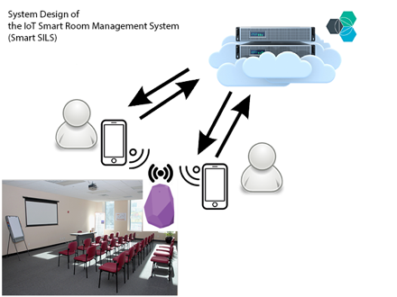

## This is the Repository of the Graduation Project of Zhenwei Wang, MSIS & CS student at UNC Chapel Hill. A Smart Room Management System using IoT Devices (Bluetooth Beacons)

Paper Title: _DEVELOPING AND EVALUATING THE Internet of Things system for laboratory Management, A USABILITY PERSPECTIVE_

- The purpose of this research is to build a smart room management system that utilizes Internet-of-things devices, cloud servers, and mobile applications. The system deliverables should include a mobile application (iOS), a backend-server hosted on the cloud, and one or more Bluetooth beacons that act as room location identifiers.

- On the server side, the system is supposed to have a cloud server so the cloud server would interact with mobile apps. Through testing and careful evaluation, the IBM® Bluemix server is selected as the cloud server.

- On the app side, the author selects React-Native as the main framework for app development. Developed by Facebook®, React-Native offered a quick and simple way for developers to write JavaScript code which later can be converted into native Android and iOS apps. The reason to use React-Native is that it allowed the usage of many open-source gadgets and plugins without the necessity of reinventing wheels. The development would be faster, although not as reliable as the native way, and more versatile, which fits the need of a proof-of-concept system development.

- The system is designed to work with multiple parties including the Bluetooth beacon, the cloud master server and the mobile app (See Figure below). The server will listen to all clients (smartphone apps) about the user information. When the user used the app to book a room, the server will record the information and forbid booking to the same room at the same time. When user hold the phone and walk into the building, the beacon will detect the user as being “in range but far away”, and the app will display such information to let user know the room is “in range but far away”. As the user gets closer, the beacon constantly updates the proximity information and notify the user when the proximity data reads as “in immediate”. User will then be automatically checked in. Some functions are developed for viewing purpose only and are not fully functional as described.

- For more information: please contact Zhenwei Wang (wangleibeckham at gmail dot com).
